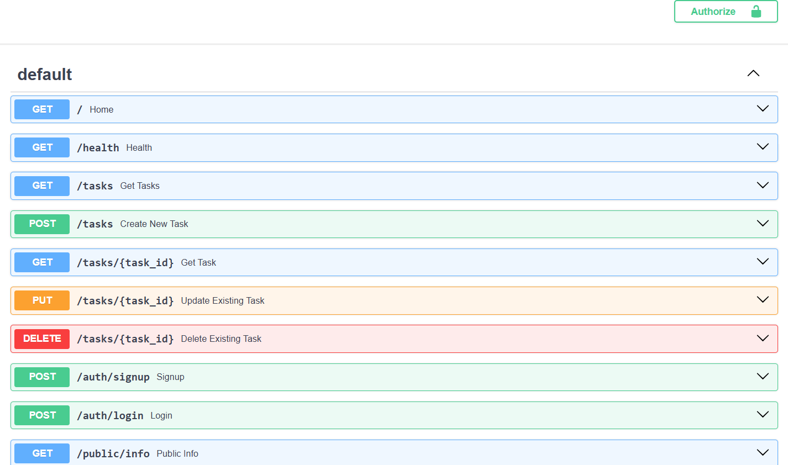
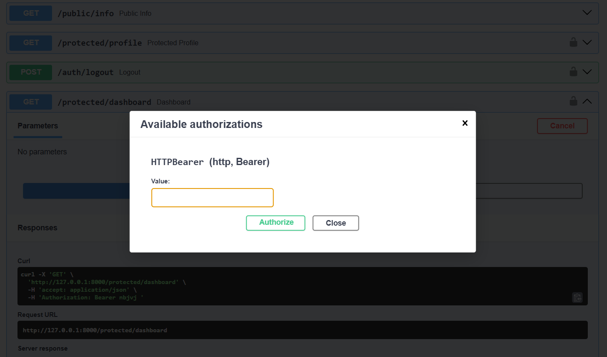

# Task API

This is a simple Task Management API developed using FastAPI as part of my FlyRank Backend Internship assignment.

## Features

- View all tasks
- View a task by ID
- Add a new task
- Update an existing task
- Delete a task
- Automatic API documentation using Swagger

## Technologies

- Python
- FastAPI
- Pydantic
- SQLite
- DB Browser for SQLite
- Uvicorn

## How to Run

Install the required packages:

```bash
pip install fastapi uvicorn
```

Run the project:

```bash
uvicorn main:app --reload
```

Open Swagger documentation:

```
http://127.0.0.1:8000/docs
```

## API Endpoints

| Method | Endpoint |
|--------|----------|
| GET | `/` |
| GET | `/health` |
| GET | `/tasks` |
| GET | `/tasks/{task_id}` |
| POST | `/tasks` |
| PUT | `/tasks/{task_id}` |
| DELETE | `/tasks/{task_id}` |

## Database Verification

To verify that the API reads directly from the SQLite database, I manually updated the database using DB Browser for SQLite while the FastAPI server was still running. Refreshing the API immediately reflected the changes without restarting the server.

### SQL Query Used

```sql
UPDATE tasks
SET title = 'Updated from DB Browser'
WHERE id = 1;
```

Result: After refreshing the GET /tasks/1 endpoint, the API returned the updated task title "Updated from DB Browser" without requiring a server restart.

## Status Codes

- 200 - OK
- 201 - Created
- 204 - No Content
- 400 - Bad Request
- 404 - Not Found

## PostgreSQL Setup

Run PostgreSQL using Docker:

```bash
docker run --name taskdb -e POSTGRES_PASSWORD=dev -e POSTGRES_DB=tasks -p 5432:5432 -v taskdata:/var/lib/postgresql/data -d postgres:16

# AI vs Me

## Prompt

Build a Task CRUD API using Python, FastAPI, psycopg, and PostgreSQL. Store the database connection string in a `.env` file and do not hardcode any database credentials. Also create a `.env.example` file with sample values. The application should automatically create a `tasks` table if it does not exist and seed it with three sample tasks only when the table is empty.

Implement the following endpoints while keeping the same behavior:

* GET `/tasks`
* GET `/tasks/{id}`
* POST `/tasks`
* PUT `/tasks/{id}`
* DELETE `/tasks/{id}`

Use parameterized SQL queries for all database operations and return the correct HTTP status codes (`200`, `201`, `204`, `400`, and `404`).

Containerize the application using Docker and Docker Compose with two services: `api` and `db`. Use a Docker volume so data persists across restarts. The API should connect to PostgreSQL using the Docker service name `db` instead of `localhost`. The entire application should start with a single `docker compose up` command.

## What AI did better

* Generated the initial project structure and boilerplate code very quickly.
* Created Docker and Docker Compose configuration automatically, providing a good starting point.

## What AI got wrong

* Generated the environment file as `env` instead of `.env`, so Docker Compose could not read the environment variables until I renamed it.
* Generated `env.example.txt` instead of the required `.env.example`.
* The Dockerfile expected an `app` folder (`COPY app ./app`), but the generated project did not contain that folder, so the Docker image failed to build.
* The generated README was less detailed than my own README and required additional improvements.

## What my implementation did better

* My README contains clearer setup instructions and project documentation.
* I tested and verified each stage manually instead of relying only on generated code.
* I debugged Docker, PostgreSQL, Docker Compose, and environment variable issues to make the project work correctly.
* My final project met the assignment requirements after testing each feature.

## What my prompt forgot

I did not clearly specify the expected project folder structure or explicitly mention the required `.env` and `.env.example` filenames. Because of this, the AI made incorrect assumptions.

## One Rematch

After improving my prompt, I clarified the project structure, required environment file names, and Docker configuration. The regenerated solution was closer to my implementation and required fewer manual corrections.

## Swagger UI Overview



## Bearer Authentication



## Author

Urvi Porwal